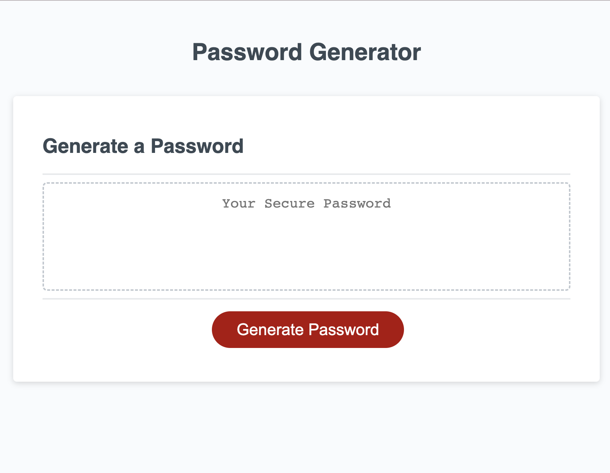

## Description
This program was made to generate a random password based on the user's selections. The selections determines if the user would like their password
to have uppercase letters, lowercase letters, special characters, or numbers. The password does have length parameters of 8-128 characters of length.
The logic of this program was created using JavaScript.

## Installation
N/A

## Usage
Users only need a computer, mobile device, or tablet with an internet connection.
Password Generator URL: 

## Credits
Tutorials used:
1. https://www.w3schools.com/jsref/met_win_confirm.asp
2. https://www.w3schools.com/jsref/met_win_alert.asp
3. https://www.w3schools.com/jsref/jsref_random.asp

## License
MIT License
